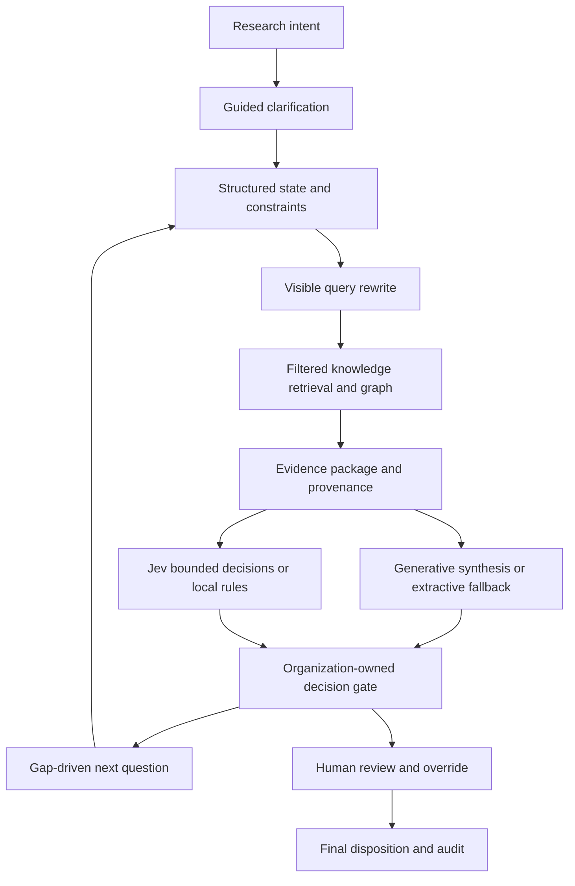

# LLM-Assisted Research Review Workflow Prototype

**Researchers provide intent. The system helps turn it into a precise, retrievable and verifiable question — then a human owns the decision.**

An independent **Business × AI research prototype**, using only **synthetic demonstration data**. Not an Ericsson system, enterprise deployment or validated user study. Development used AI assistance.

## Run the interactive demo — no key or pip installation required

Python **3.9+**, standard library only. Clone this existing repository, then:

```bash
python3 -m reviewflow.web
```

Open **http://127.0.0.1:8765**. Select a synthetic proposal and start a review.

1. Submit **“Can you check whether this research is good enough? Exclude patents.”**
2. The system asks **what to evaluate**, rather than producing an unrestricted answer.
3. Choose **Novelty**, then investigate. Inspect persistent state and the standalone query.
4. Expand evidence: exact text, section, date, document ID, source location, hash and score.
5. Inspect overlapping work, contradictory findings and the unresolved citation.
6. Select a **next-best question** to investigate the contradiction or evidence gap. Constraints persist.
7. A human chooses **Revise**, explains the judgment and describes required changes. Overrides require a reason.
8. Inspect the complete audit trail and observed metrics; download JSON. Reloading preserves the workspace.

No credentials: **Decision Engine: Local Deterministic Fallback** and **Local Extractive Synthesis (not an LLM)**. These labels are intentional. Real inference is optional and never impersonated.

## Problem and product idea

Researchers should not need to become prompt engineers or manually search fragmented research knowledge. This prototype operationalizes:

**Ambiguous intent → clarification → structured state → query rewrite → knowledge + graph → evidence → synthesis + bounded decisions → next question → human disposition → audit.**



## Key features

- Guided ambiguous input with six review objectives and free-text clarification.
- Structured multi-turn state; date, scope and patent exclusions survive follow-ups.
- Inspectable rewrite; metadata-rich knowledge base with **16 synthetic documents across three areas**.
- Functional graph: citations, related work, extensions, contradiction witnesses, author/topic links and evidence links. A graph/table is visible in the UI.
- Filtered lexical RAG with graph boosts; source constraints apply before graph expansion.
- Evidence packages with stable IDs, exact source text and JSON-path provenance. Proposal text is separate from independent evidence.
- Optional local **Ollama** for clarification, query rewriting and research synthesis; malformed outputs, lost rewrite constraints and fabricated citations fall back visibly.
- Real **Jev HTTP integration** for intent classification, evidence sufficiency, risk, routing and escalation. Automated tests mock external calls.
- Configurable governance in [config/governance.json](config/governance.json), separate from prompts.
- Structured review, explicit decision gate, tailored next questions, human Approve / Reject / Revise / Escalate, override reason and immutable final disposition.
- Persistent SQLite audit with state snapshots and hash-chain verification, downloadable review/audit JSON and measured session metrics.
- Reproducible context-compression experiment, synthetic benchmark and preserved V4 RCA/regression tooling.

## Signature feature: Next-Best-Question

The system uses **intent + state + retrieved evidence + gaps + contradictions + stage** to select up to three questions, each with a reason and evidence links where relevant. For the network proposal it surfaces:

- Why do the earlier scheduling study and burst-traffic replication disagree?
- Which approval criteria still lack ethics evidence?
- Can the unresolved citation be verified or corrected?

Selecting a question changes the investigation objective within the same workspace. It preserves patent exclusions, dates and scope, and records the selection in the audit. `investigated_questions` tracks explored questions; it does **not** pretend the evidence gap has been resolved. The unresolved evidence remains visible.

## Human–AI responsibility boundary

| Component | Responsibility | Authority |
|---|---|---|
| Generative LLM | Clarify, rewrite, synthesize, compare and explain | Produces drafts; cannot finalize |
| Jev / bounded adapter | Classify, score, estimate sufficiency and suggest a route | Fixed decision spaces; policy can override routing |
| Organization policy | Mandatory evidence, thresholds, role and escalation boundaries | Defined in configuration, never invented by a model |
| Human reviewer | Inspect sources, decide, revise, override and explain | Owns final high-impact judgment |

High confidence never confers approval authority. High-impact investigations route to humans regardless of confidence. Unresolved mandatory evidence or conflicts block final approval. Generated rationale requires human semantic-support confirmation before approval. Identity and roles are **self-declared demo controls**, not enterprise authentication.

## Business × AI

| Layer | Working implementation |
|---|---|
| Technology | LLM adapter, RAG, graph, evidence grounding, typed Jev decisions |
| Process | Submit → clarify → investigate → recommend → human revise/reject/approve/escalate |
| Human | Source inspection, visible uncertainty, override and final rationale |
| Organization | Configured policy, declared decision owner, human authority and audit |
| Business value | Observed elapsed lead time, section coverage, gaps, acceptance, overrides, escalations and API usage |

Metrics show only actual session observations. Empty denominators display “Not measured”; unknown API cost and gold retrieval recall remain null. Elapsed lead time includes idle time; it is not reviewer labor or demonstrated productivity gain.

## Jev configuration — official API, no committed credentials

Contract verified via TypeSafe's official website documentation on **2026-10-02 UTC**:
[API](https://docs.typesafe.ai/api), [models](https://docs.typesafe.ai/models), [confidence](https://docs.typesafe.ai/confidence).

Endpoint: `https://api.typesafe.ai/v1/systemone`. The documented primitives are **choice**, **score**, and **noul** (yes probability). `jev-latest` currently resolves to `jev-1.13.0`; the returned model version and token usage are retained. No unsupported binary API is invented.

```bash
export JEVMODEL_API_KEY="YOUR_KEY_FROM_TYPESAFE"
export JEVMODEL_MODEL="jev-latest"
python3 -m reviewflow.web
```

Use a pinned model ID when validating domain thresholds. `.env.example` contains placeholders; the app reads exported environment variables and does **not** automatically load `.env`. Never paste keys into code, logs, screenshots, commits or issues.

Configured key → Jev; no key → local deterministic adapter. API timeout, HTTP error or invalid response → explicit local fallback with sanitized error type. No silent retries or fabricated confidence. Displayed raw distributions and scores come only from successful validated responses. Cost remains unknown; pricing is not hard-coded.

**Verification boundary:** the real HTTP adapter and contract have been tested using mocks. Live authenticated Jev inference and live Ollama inference have not been run in this environment; no credentials or installed local model were supplied. No domain calibration is claimed.

## Optional actual generative LLM

Install/run Ollama yourself and select a model already installed locally:

```bash
export REVIEWFLOW_OLLAMA_MODEL="YOUR_INSTALLED_MODEL_NAME"
python3 -m reviewflow.web
```

Calls the local `/api/chat` endpoint for guidance/rewrite and review. Guidance cannot replace authoritative state filters. Review citation IDs and exact quotations are validated; semantic entailment still requires a human. No model download or cloud LLM bill is required by this repository.

## Tests, reproducible demonstration and evaluation

```bash
python3 -m unittest discover -s tests -v
python3 examples/run_workflow.py --out runs/workflow-demo
python3 -m reviewflow.benchmark --out runs/benchmark
```

`compression.json` compares a deliberately naive **last-turn-only summary** with structured state. It measures constraint retention on the supplied conversations; it is not live LLM summarization research.

`benchmark.json` measures source traceability, gold fixture retrieval recall, section coverage, deterministic decision consistency, routing and machine execution timing. **Human-only vs LLM/RAG vs hybrid** is an evaluation protocol, not invented user-study results. See [evaluation](docs/WORKFLOW_EVALUATION.md).

## Preserved earlier work

The existing V4 branch was integrated rather than discarded. Its packet ingestion, exact quote validation, CLI, support labeling, final-disposition rights, RCA, local improvement proposals and frozen regression cases remain usable:

```bash
python3 -m reviewflow run --out runs/packet
python3 -m reviewflow verify --out runs/packet
python3 demo/run_v4.py --out runs/v4-demo
python3 -m reviewflow retest runs/v4-demo/regression/retention.json
```

The packet CLI and interactive workspace have separate journals and schemas. V4 approval dispositions are per finding; interactive dispositions are per research investigation. Neither grants real study authorization. See [legacy V4](docs/V4.md).

## Repository map

| Location | Purpose |
|---|---|
| `reviewflow/context.py` | Intent, clarification, state and rewrite |
| `reviewflow/knowledge.py`, `data/synthetic/` | Corpus, metadata, graph and retrieval |
| `reviewflow/decision.py`, `policy.py`, `config/` | Jev/local adapters and governance gate |
| `reviewflow/synthesis.py`, `recommendation.py` | Optional generative work and next questions |
| `reviewflow/workspace.py`, `web.py`, `ui.html` | Persistent workflow and interactive UI |
| `reviewflow/benchmark.py`, `examples/`, `tests/` | Experiments, demo and tests |
| Existing `core/storage/governance/evaluation/regression` modules | Preserved V4 packet workflow |

## Limits and realistic future work

Lexical retrieval is lightweight, not semantic embeddings. Contradictions and citation relationships are authored synthetic graph metadata, not general automatic prose contradiction detection. Section presence is not proof of evidence quality; source hashes prove identity, not truth. Guidance rewrite validation detects missing required text, not every possible negation or semantic drift; typed filters remain authoritative. Self-entered reviewer identity and hash chains are not compliance-grade controls. The local server binds to loopback only; do not expose it as a production service.

The UI selects bundled proposals; general PDF upload/OCR, enterprise SSO, authenticated decision rights, multi-tenant security, semantic adjudication and live model calibration are future work. Next research steps: independently annotate held-out cases, run live-model evaluations, then conduct a counterbalanced reviewer study of time, quality, trust and override behavior.

Technical documentation: [gap analysis](docs/GAP_ANALYSIS.md) · [architecture](docs/WORKFLOW_ARCHITECTURE.md) · [governance/business logic](docs/WORKFLOW_GOVERNANCE.md) · [evaluation](docs/WORKFLOW_EVALUATION.md).
