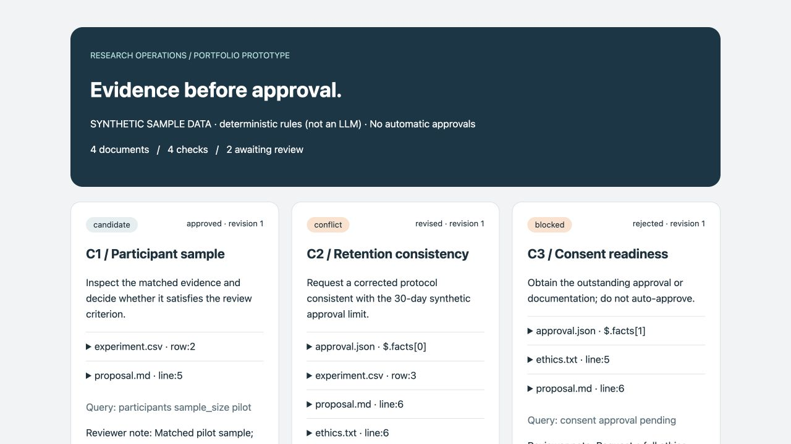
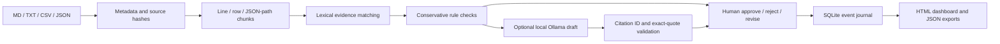

# LLM-Assisted Research Review Workflow Prototype

**An evidence-first Python portfolio prototype for research review and human decision-making.**

All bundled documents, numbers, organizations, reviewer identities and demonstration decisions are **synthetic**. This is an independent portfolio project, not an Ericsson system, employer deliverable, production deployment or validated research study. Initial implementation was generated with AI assistance; candidate understanding and personal validation must be demonstrated separately.

The prototype turns a small research packet into traceable review recommendations. It demonstrates knowledge management, document curation, research workflow, a review-approval process, human-AI collaboration and provenance. Its enterprise AI relevance is architectural; enterprise readiness is not claimed.



## Quick start — no key, no installation, no paid service

Python 3.9+ (locally tested on 3.9.6; modern Python recommended). From this repository:

```bash
python3 -m unittest discover -s tests -v
python3 -m reviewflow run --out runs/my-review
```

Open `runs/my-review/dashboard.html` in a browser. The HTML is portable and **read-only**; all human decisions use the CLI. No web server is required. Every run starts with all findings pending.

```bash
python3 -m reviewflow decide C1 approve --out runs/my-review --reviewer "Your name" --note "Checked the participant-count evidence; accept the recommendation." --revision 0
python3 -m reviewflow decide C2 revise --out runs/my-review --reviewer "Your name" --note "The draft and approval register conflict." --revision 0 --replacement "Request a protocol aligned with the approved retention limit."
python3 -m reviewflow decide C3 reject --out runs/my-review --reviewer "Your name" --note "Require broader ethics review rather than this narrow recommendation." --revision 0
python3 -m reviewflow verify --out runs/my-review
```

Reopen/refresh the HTML after a decision. `approve` accepts a **review recommendation**, not permission to conduct research. A revised recommendation remains awaiting review; approve it with its new `--revision 1`. Approved/rejected decisions are terminal within that run. Create another run for reconsideration; existing runs cannot be overwritten.

## What the sample demonstrates

| Check | Default result | Why |
|---|---|---|
| Participant sample | Candidate | Matching participant evidence requires human interpretation |
| Retention consistency | Conflict | Structured records contain 90 versus 30 days |
| Consent readiness | Blocked | Structured approval status is pending |
| Power calculation | Missing | No passage matches the query; not proof of absence |

There is no measured productivity gain, LLM accuracy score or production result. Four hand-authored cases are behavior fixtures, not an independent benchmark.

## Pipeline



Every matched passage retains source filename, location, exact text, chunk ID and SHA-256. Missing findings retain the query and the complete corpus snapshot in the run. Suggested interpretations are not themselves established facts.

## Optional actual LLM: local Ollama

The default is a **deterministic rules baseline, not an LLM**. No cloud API integration or API key is needed. If you already have Ollama and a local model installed:

```bash
python3 -m reviewflow run --out runs/local-llm --model YOUR_INSTALLED_MODEL_NAME
```

The adapter calls `http://127.0.0.1:11434/api/chat`, requesting JSON with streaming disabled. Supply the exact name of a model available on your machine. No model is downloaded by this project. See the [official Ollama API documentation](https://github.com/ollama/ollama/blob/main/docs/api.md).

Failures, timeouts and invalid citations preserve the deterministic recommendation and are counted in the run metadata. The dashboard shows how many validated model drafts were actually produced. No evidence means no LLM call. A valid quote only proves the text exists: a model may still draw the wrong conclusion. Both rule result and LLM draft remain visible, and the LLM cannot change decision status.

**Validation status:** optional adapter tested with mocked HTTP responses, including malicious/fabricated citations. No live local model inference was performed for this release. Model quality and prompt-injection resistance are unvalidated.

## Repository map

```text
reviewflow/
  core.py          parsing, metadata, retrieval, rules, Ollama, citations
  storage.py       transactional decisions, event replay, hash-chain checks
  dashboard.py     escaped portable HTML, JSON export
  __main__.py      CLI
sample_data/       four synthetic sources + review criteria
tests/            workflow and failure-path tests
docs/
  ARCHITECTURE.md  design choices, state machine, limitations
  EVALUATION.md    observed tests and future evaluation plan
  SCREENSHOTS.md  screenshot reproduction instructions
  examples/       executed synthetic dashboard/review/audit exports
requirements.txt   zero third-party runtime dependencies
.github/workflows/tests.yml  cross-version CI configuration
```

## Bring your own synthetic packet

```bash
python3 -m reviewflow run --input path/to/packet --criteria path/to/criteria.json --out runs/new-packet --data-label "MY SYNTHETIC PACKET"
```

Supported: UTF-8 `.md`, `.txt`, `.csv`, `.json`, top-level files only, at most 1 MB per document. PDF/OCR/DOCX are deliberately out of scope. JSON documents require a `facts` array; criteria are passed separately or stored as `criteria.json`, which is excluded from evidence. CSV uses `fact_key,value,unit,note`. Each criterion has unique `id`, `title`, `query`, optional `fact_key`. See bundled examples.

Free text uses line-level chunks; CSV uses logical record numbers (not physical lines for multiline CSV); JSON uses `$.facts[index]`. Metadata includes source format/hash; text may declare `owner:` and `version:`; JSON may include `title`, `owner`, `version`, `synthetic`. Metadata is input-supplied, not externally verified. Units are compared literally, not converted. Numerically equivalent formatting such as 30 and 30.0 may be flagged conservatively.

`--data-label` is user-declared, not a synthetic-data detector. Do not add real confidential research to the public repository. Runtime outputs are ignored by Git. All committed example exports were generated solely from the bundled synthetic packet.

## Scope and limits

- Lexical token matching, not embeddings, semantic search or a knowledge graph. Synonyms, multilingual text and complex prose can be missed.
- Rule-based conflicts concern matching structured `fact_key` records. Arbitrary prose contradictions are not detected automatically.
- Human identities are self-entered. No authentication, roles, tenant isolation or electronic signatures.
- Event hashing detects ordinary edits but cannot prevent an administrator rewriting the database and hashes or truncating the end of the log. It is not a compliance-grade audit system.
- No external validation, user study, production deployment, regulatory certification or enterprise performance benchmark.
- Requirements such as SSO, access controls, retention policy enforcement and reviewer usability studies are future work.

See [architecture](docs/ARCHITECTURE.md), [evaluation](docs/EVALUATION.md), and [screenshots](docs/SCREENSHOTS.md). The bundled [HTML example](docs/examples/dashboard.html) must be downloaded/opened locally to render; GitHub displays its source.
