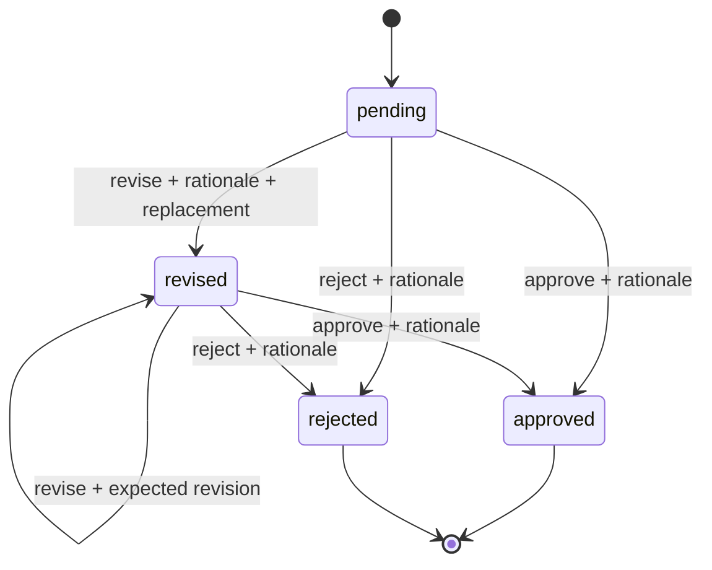

# Architecture and design decisions

## User need
A research coordinator needs to curate a heterogeneous packet, identify evidence gaps and conflicting records, and ask a human reviewer for a documented decision. The narrow prototype handles this one workflow using synthetic material.

## Contracts
1. Ingestion snapshots original text chunks with source hashes and locations. A changed document creates different IDs in a new run.
2. Retrieval scores token overlap divided by query-token count, adds 1 for an exact structured fact-key match, sorts by score and stable ID, and returns up to 5 passages. These scores are matching heuristics, not probabilities.
3. Rules examine all structured records for each requested fact key, including beyond top-k. Different literal value/unit pairs trigger conflict. Pending/rejected/missing structured values trigger blocked. Empty retrieval triggers missing; otherwise candidate. Conflicting fact witnesses are appended to evidence even beyond top-k.
4. Optional Ollama receives only that finding's evidence and rule result. A system instruction treats documents as untrusted. Returned citations must reference allowed IDs and contain exact nonempty quotes. This is a structural guard, not a semantic guarantee or comprehensive injection defense.
5. No backend automatically approves. Decisions require reviewer, rationale and expected revision. A revision requires replacement recommendation text. The original event remains intact.
6. SQLite `BEGIN IMMEDIATE` serializes mutations. Stale expected revisions fail rather than overwriting a review. State is rebuilt from a deep copy of the creation event and subsequent decisions.
7. Hash-chain verification happens before state replay/export. Derived HTML/JSON can be regenerated with `export`; SQLite is authoritative. If export fails after a committed decision, export again rather than resubmitting the decision.

## State machine

These states refer to **review recommendations**. A reviewer can accept a recommendation to resolve a conflict without asserting that the underlying research is approved. Study authorization is outside scope.

## Storage
`events(seq, payload, previous, hash)`: first event contains documents, chunks, criteria, mode, findings and adapter errors. Subsequent events contain action, finding ID, reviewer, rationale, replacement, revision and UTC timestamp. SHA-256 hashes chain canonical JSON payloads. A single run lives in one directory; no migrations or shared service are implemented.

`review.json` = derived current state. `audit.json` = original creation snapshot plus subsequent events. `dashboard.html` = escaped, read-only view. Inline styles only, no external assets, no JavaScript and no network calls from the HTML.

## Why these choices
- Standard library keeps the baseline reproducible without a paid key or dependency installation.
- CLI mutation plus static HTML avoids pretending a demo has enterprise authentication.
- Transparent lexical retrieval makes errors inspectable at this scope.
- Local model adapter enables a real optional LLM path without making inference a prerequisite.
- Explicit limitations make a useful thesis starting point: compare retrieval methods, test reviewer trust and measure evidence-grounded decisions.

## Research extension
Use a held-out synthetic packet set and independent human labels. Compare rule-only and LLM-assisted review on citation support, missed issues, false positives and reviewer decision time. Counterbalance packet order and document task difficulty. Do not claim causal time savings before collecting an appropriate study.
